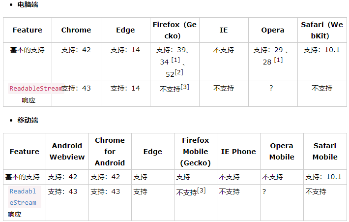

# Ajax的使用
作为一个完整的前后端分离的系统，Ajax必不可少，本项目Ajax技术选用fetch；
fetch是es6的一种新技术，正在逐渐走向主流，当然这句话的意义就是当前Fetch的兼容型还是很有问题，用一句广告就是“兼容有风险，使用需谨慎”，我发现我的文案功底越来越好了，赶明儿转行做职业文案吧* __ *；
## 兼容性
> 注意：由于Fetch API是基于Promise设计，旧浏览器不支持Promise，需要使用pollyfill es6-promise

   
`以上部分原文见`[W3Cschool-FetchAPI官方文档-最新版：2018-1-20](https://www.w3cschool.cn/fetch_api/fetch_api-w7mt2jzc.html) 

由上图可见到目前为止Fetch已兼容部分浏览器，不过系统受众若是比较老的手机或计算机版本您还是使用主流的Ajax更佳。

## 使用
本系统因为是基于React的，所以将Fetch分装成一个单独的组件使用起来更加方便，废话不说，直接上组件（api-data.js）代码：
```
    export default class HttpUtils{
        static get=(url)=>{
            return new  Promise(((resolve, reject) => {
                fetch(url)//默认是GET
                    .then(response=>response.json())
                    .then(result=>{
                        resolve(result);//表示完成
                    })
                    .catch(error=>{
                        reject(error);//表示失败
                    })
                })
            )
        };
        static post=(url,data)=>{
            return new Promise(((resolve, reject) => {
                fetch(url,{
                    method:'POST',
                    header:{
                        'Accept':'application/json',//告诉服务器，我们能接受json格式的返回类型，
                        'Content-Type':'application/json',//告诉服务器，我们提交的数据类型
                    },
                    body:JSON.stringify(data),
                })//返回 服务器处理的结果
                    .then(response=>response.json())
                    .then(result=>{
                        resolve(result);
                    })
                    .catch(error=> {
                        reject(error);
                    })
                })
            )
        }
    }
```

然后我们新建一个服务器，React本地放静态Json数据不能用，React服务器将收到的所有路由都解析并指向页面，拿不到数据
这里我使用了Apache服务器，咋弄呢？
这里做个剧透，数据交互的时候有种状况叫跨域，那啥叫跨域呢？简单说就是要访问的数据和访问端不在同一协议、域名、端口下的都叫跨域，就比如http://www.example.com下的网页访问https://www.example.com、http://www.example.com下的网页访问http://www.notExamplt.com以及http://www.example.com:80下的网页访问http://www.example.com:8080下的数据都算跨域。

## Apache服务器搭建
Linux中搭建Apache比较麻烦，在windows中搭建还是比较简单的，先去官网下载对应的[Apache](http://www.apachelounge.com/download/VC15/binaries/httpd-2.4.34-win64-VC15.zip)文件（链接地址为windows版x64位）；
之后将apache解压到C盘根目录下，当然如果不想解压到C盘也可以解压到任意盘，之后进行配置：
例如我将apache解压到D盘根目录下；
打开apache下的conf文件夹下的httpd.conf文件，找到`Define SRVROOT "c:/Apache24"`（应该是37行），修改为`Define SRVROOT "d:/Apache24"`,监听80端口，如果想修改成别的端口，只需修改60行的端口号即可，然后在226行应该`#ServerName`,复制这句话然后拷贝到下一行，删除#， 配置ServerName地址，如下：
```
    #ServerName localhost:80
    ServerName localhost:80
```
然后到Apache24文件夹下Bin文件下找到httpd.exe并打开，此时不出意外服务器就启动起来了，然后在浏览器输入127.0.0.1:80即打开网页，这个网页位于apache24目录下的htdocs文件夹下，我们新建一个Json文件命名为test.json,里面放一个标准格式的Json，然后在浏览器输入127.0.0.1:80/test.json,页面上打印出我们新建的Json。然后就是在React项目中访问在这儿放的Json;

## React中App.js调用
直接上代码：
```
    componentWillMount(){
        APIData.get("http://127.0.0.1/Data/data.json")
        .then((result) => {
           console.log(ressult);
        })
        .catch((error) => {
            console.log(error);
        })
    }
```
此处的componentWillMount是react的生命周期函数，即在组建加载之前执行， 先跑一遍代码，结果报错：
```
    Failed to load http://127.0.0.1/Data/data.json: No 'Access-Control-Allow-Origin' header is present on the requested resource. Origin 'http://127.0.0.1:3000' is therefore not allowed access. If an opaque response serves your needs, set the request's mode to 'no-cors' to fetch the resource with CORS disabled.
```
意思很明白了，就是同源策略导致的这个问题，在这里唠叨几句同源策略：
所谓的同源策略就是web应用的安全模型中的重要一环，在这个策略下，web应用被允许访问同源下的数据，但最大的前提就是同源；举个例子，一个家族兄弟比较多，每家都有自己独立的院子，出院子的门也是唯一的，此时这个叫家族里各个兄弟都成家了，兄弟A可以使用他家的所有的钱，这就是同源即有权限访问数据；那么别的域名或端口下的主机能不能访问这台主机呢？接上面的例子：有一天兄弟B日子过你下去了，寻求兄弟A的支援，兄弟A当然可以在保障自己生活的前提下支援B，前提是兄弟A对此事知情且同意，如果兄弟A不知情或者不同意而兄弟B任然拿走兄弟A的资源，那兄弟B就是违法行为。
    
项目中也一样，其他域名的访问本网站下的资源，就需要设置同意别的网站跨域访问的协议，我们需要在apache下的conf文件夹下的httpd.conf文件中加一句话即可：`Header set Access-Control-Allow-Origin *`,此时在访问就能访问到数据并打印在控制台了。

