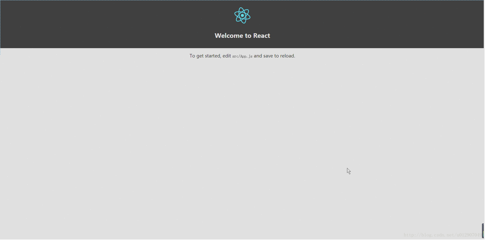

# 搭建环境
首先是安装react脚手架，官方给出的脚手架是Create React App；

Create React App 是开始构建新的 React 单页应用程序的最佳方式。它已经为你设置好了开发环境，以便您可以使用最新的 JavaScript 特性，提供不错的开发体验，并且可以优化你的生产环境应用。你需要在你的机器上安装 Node >= 6 。
```
npm install -g create-react-app
create-react-app my-app

cd my-app
npm start
```
当让如果你的npm版本低于6但是大于5.2.5，则使用一下的命令安装，若npm版本更低则自行升级npm版本
```
npx create-react-app my-app

cd my-app
npm start
```
安装成功后在命令中打开文件夹，使用`npm start`启动脚手架内置的服务器。

Create React App 不会处理后端逻辑或数据库；它只是创建一个前端构建管道（build pipeline），所以你可以使用它来配合任何你想使用的后端。它使用像 Babel 和 webpack 这样的构建工具，但是已经为你配置好了，你可以零配置使用。

当您准备好部署到生产环境中时，运行 npm run build 将在 build 文件夹中创建一个应用程序的优化构建。您可以 从其 README 和 用户指南 中了解有关 Create React App 的更多信息。

启动项目后就能看到如下图这样的页面：

本项目UI框架我们采用Ant Design框架，首先引入AntD组件库npm命令：`npm install antd`, 使用yran安装组件库命令：`yran add antd`，
首先我们做一个页面导航，新建文件：navi.js和navi.css，然后在js中引入文件
```
import { Layout, Menu, Breadcrumb, Icon } from 'antd';
import React, { Component } from 'react';
import 'antd/dist/antd.css';
import logo from '../logo.svg';
import './navi.css'
const { Header, Content, Footer, Sider } = Layout;
```
到这里开发环境就搭建好了，后面开发的请看下一节

