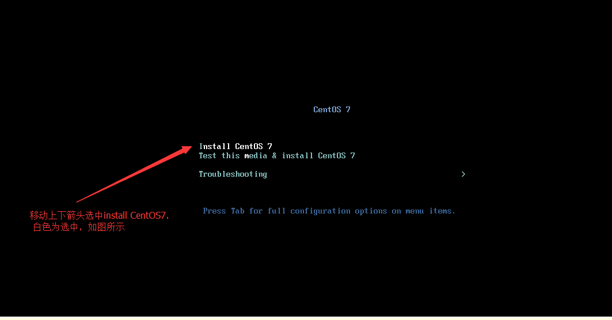

* 本笔记来主要源于[AllEmpty](http://www.cnblogs.com/EmptyFS/)大神

# centOS搭建
为了方便起见，我们将服务器搭建在虚拟机上，第一步就是安装虚拟机
* 虚拟机的安装在这儿不做赘述，
首先我们安装centOS系统
第一步： 这里我们选择系定义模式，看下图
  

第二步：选择虚拟机的硬件和功能，这里我们选择Workstation 10.x
  

第三步： 安装虚拟机操作系统，这里我们选择稍后安装操作系统
  

第四步： 选择虚拟机操作系统和版本，我们选择Linux系统的CentOS 64X版本
  

第五步： 输入虚拟机名称，指定安装的位置
  

第六步： 选择处理机配置， 这个根据电脑情况选择，在不影响宿主机器的情况下选择，我使用的是1个处理器双核版本
  

第七步： 给虚拟机配置内存， 对于目的是用来学习的主机的话1024M就够了
  

第八步： 网络类型选择，这里选择使用网络地址转换（Nat）
  

第九步： 选择I/O控制器类型，这里我们选择SLILogin(L)控制器
  

第十步： 选择磁盘类型， 这里我们选择SCSI（s）
   

第十一步： 选择磁盘，这里我们选择创建新虚拟磁盘
  

第十二步： 为新创建的磁盘制定容量， 一般情况下20G足够了， 然后选择将虚拟磁盘拆分为多个文件，下一步
  

第十三步： 制定新建虚拟磁盘的名称，后缀名为vmdk则为虚拟磁盘文件
  

第十四步： 点击完成即可

第十五步： 双击主面板上CD/DVD选项
  

第十六步： 点击使用IOS镜像文件，然后指定镜像文件的路径
  
 
第十七步： 点击弹框中的网络适配器， 选择“自定义： 特定虚拟网络”， 下拉菜单中选择VMWare 10选项
  
  
第十八步： 在VMWare主页面中的菜单栏中选择“编辑”  -- “虚拟网络编辑器”
  
第十九步： 打开虚拟网络编辑器后提示需要管理员权限才能修改网络适配器权限，点击更改设置
  

第二十步： 选中WMnet8 -- NAT模式，确定
  

第二十一步： 开启虚拟机  
  
  
第二十二步： 选择install CentOS 7选项， 这儿有点坑， 我的安装时看不太清楚，白色是选中，
  
  
第二十三步： 按下回车  
  

第二十四步： 全选English， 然后点击Continue按钮  
  

第二十五步： 先选择NETWORK AND HOST NAME , 点击  
  

第二十六步： 打开Ethernet开关，然后点击Done  
  
  
第二十七步： 点击INSTALLATION DESTINATION  
    
  
第二十八步： 点击Done即可  
  
  
第二十九步： 点击Begin installation按钮  
  
  
第三十步： 点击ROOT Password按钮设置密码  
  
  
第三十一步： 设置密码，注意下面的框子是重新输入，密码注意数字字母搭配  
  
  
第三十二步： 点击reboot进行系统安装最终一步  
  
  
第三十三步： 系统重新选择第一条启动项启动  
  
  
第三十四步： 输入用户名root，输入密码就是刚才你设置的密码。  
到这儿就系统安装全部结束了  