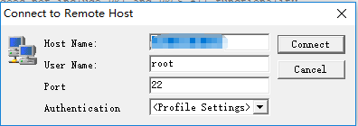
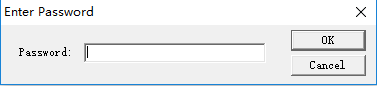
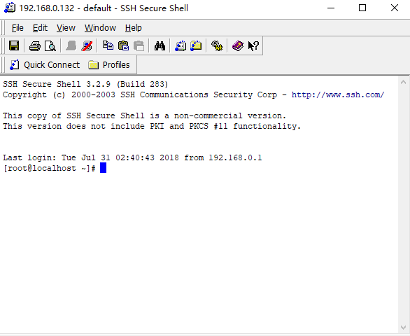
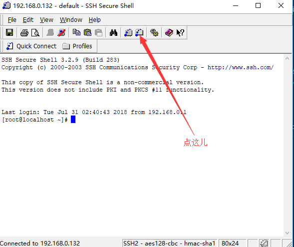
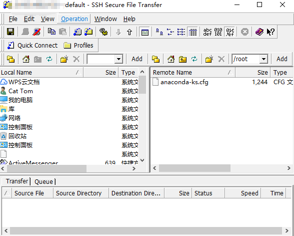

# centOS初始化配置
## 安装ifconfig
刚安装成功centOS，我们先给系统安装：ifconfig（类似于windows中的ipcoonfig）
我们使用yum安装
输入`yum search ifconfig`搜索安装包
然后输入`yum install net-tools.x86_64`
然后在在终端输入ifconfig就能查询ip地址了

## 安装ssh
这一步我们需要在客户机上安装ssh，然后连接在虚拟机里安装的系统，我们就能在客户机操作服务器了；
首先去官网下一个SSH，给个路标去[SSH官网](https://www.ssh.com/ssh/download/);
安装完成后打开SSH客户端，如下图：

点击图片中指的按钮连接远程服务器  

host name 为你远程服务器的IP地址， 一般是192.168.0.128， 不过我的IP地址不是，如果你的也不是，就需要使用上面的ifconfig了， 在服务器输入ifconfig获得服务器的IP地址， username一般是root， 端口号是22，然后点击COnnect连接，这时会跳出如下的密码输入框，  

输入密码就能连接远程服务器了，连接成功界面如下：  

当然SSH还有个很强大的功能， 文件传输：  

打开文件传输窗口  
 

在这儿我们能很简单的将文件上传到服务器的指定位置